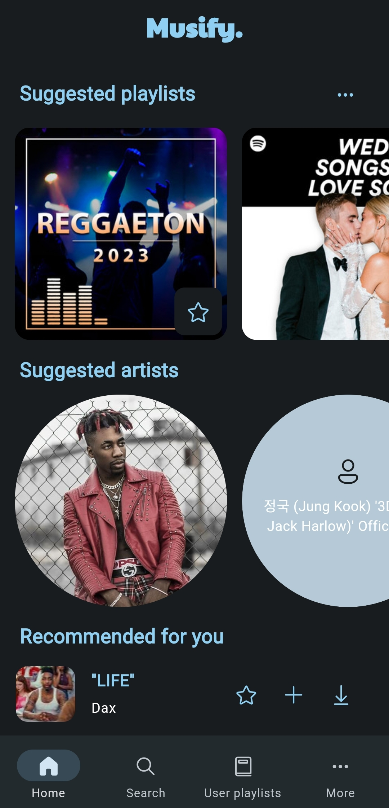
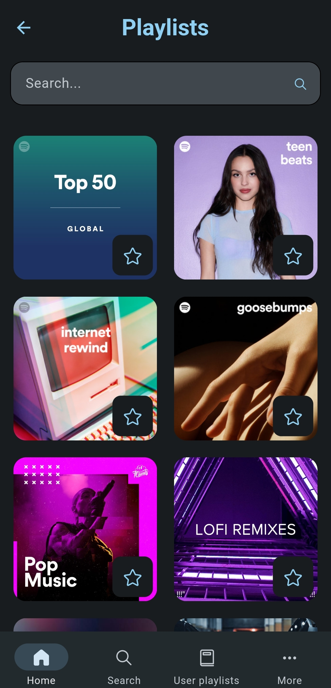
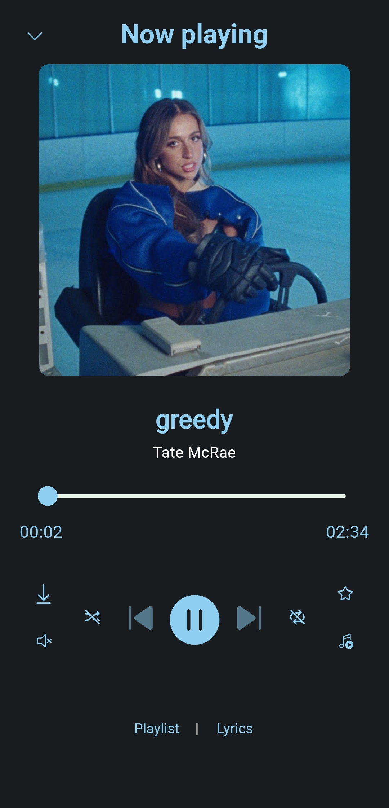
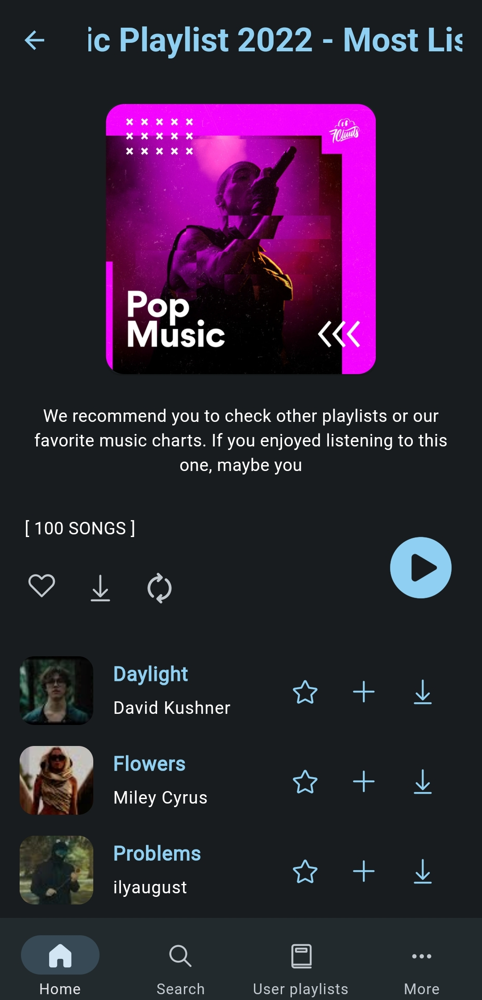

<p align="center">
    Unlock the full potential of music: Stream effortlessly with one app!
</p>

<h3 align="center">Don't forget to :star: the repository</h3>

---

  <h3>Features :rocket:</h3>
  <p>
    Online Song Search With Suggestions :mag:<br>
    Streaming Support :musical_note:<br>
    Offline Listening Support :arrow_down:<br>
    Import & Export Your Data And Never Lose It :floppy_disk:<br>
    Add Custom Playlists With Link :cool:<br>
    Optimized Sound Experience :fire:<br>
    Lyrics Support :pencil:<br>
    No Ads :no_entry_sign:<br>
    No Subscriptions :dollar:<br>
    Inbuilt Updater :new:<br>
    14 Supported Languages :us:<br>
    Material UI & Accent Colors & Dynamic Colors (Android 12+) :art: <br>

---

<h3 align="center">Screenshots :camera:</h3>

<div align="center">
  <table>
    <tr>
      <td align="center">
        
      </td>
      <td align="center">
        
      </td>
      <td align="center">
        
      </td>
      <td align="center">
        
      </td>
    </tr>
  </table>
</div>


<h3 align="center">Building from source :hammer_and_wrench:</h3>

1. If you don't have Flutter SDK installed, please visit official [Flutter](https://flutter.dev/) site.
2. Fetch latest source code from master branch.

```
git clone https://github.com/twinik/clone-musify-music-app.git
```

3. Run the app with Android Studio or VS Code. Or the command line:

```
flutter pub get
flutter run --flavor github
```

---